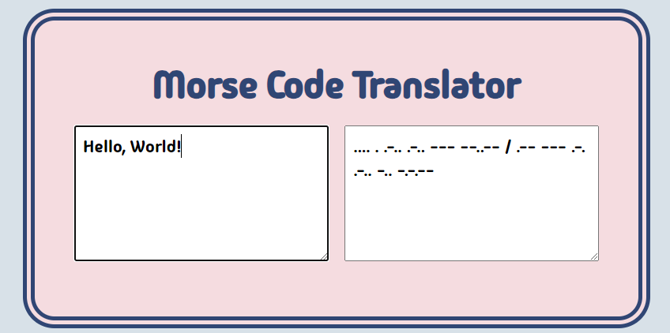

# Morse Code Translator

## Snippets



## Description

The Morse Code Translator is a web application that allows users to translate text between English and Morse Code. The application provides a simple and user-friendly interface for inputting English text or Morse Code, and includes JavaScript functions to handle the translation.

### Tech Stack

- HTML
- CSS (SCSS)
- JavaScript

## Features

- Input fields for English text and Morse Code.
- Seamless translations.
- Results display in corresponding input fields.

## Build Steps

1.  Clone the repository.

```shell
git clone https://github.com/Abbby3/morse-translator.git
```

2.  Navigate to the project directory.

```shell
cd morse-translator
```

4.  Run the application

```shell
start index.html
```

## Future Goals

- Add sound effects for Morse Code playback.
